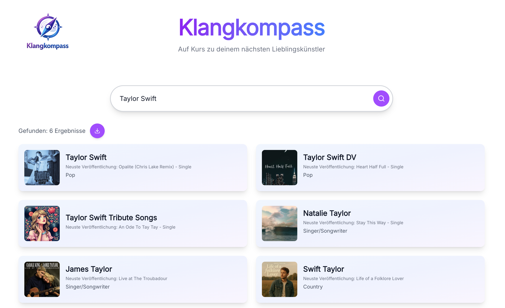

# Klangkompass
Klangkompass is a modern website for searching music artists.
The website uses the public iTunes Search API for artist and album information.

## Feautures
- Search for music artists
- Presentation of the newest album and album cover of the searched artists
- CSV export of all search results
- Suggestions of artists at the start page
- Responsive design

## Technical Documentation
### Tech Stack
- React
- TypeScript
- Vite
- TailwindCSS
- Lucide Icons
- iTunes Search API

### Requirements
- Node.js (v18 or higher recommended)
- npm

### Local Setup
1. Clone this repository
2. Install dependencies
   ```bash
   npm install
   ```
3. Start development server
   ```bash
   npm run dev
   ```
4. The website will now run at
   ```bash
   https://localhost:5173
   ```

### iTunes Search API
No API key is required. 
Artists are searched like following:
```
https://itunes.apple.com/search?term=ARTIST_NAME&entity=musicArtist
```

### Project Structure
```
src/
 ├── components/
 │    ├── ArtistCard.tsx
 │    ├── SearchBar.tsx
 │    └── SuggestionChips.tsx
 │
 ├── assets/
 │    └── klangkompass-logo.png
 │
 ├── App.tsx
 └── main.tsx
```
#### ArtistCard.tsx
ArtistCard is responsible for presenting the artists resulted from the search.

#### SearchBar.tsx
SearchBar handles user input and delegates search logitc to App.tsx

#### SuggestionChips.tsx
SuggestionChips enhances UX by providing quck access to popular artists.

#### App.tsx
App.tsx is the central logic and state management layer of the application. It handles the communication with the iTunes Search API, processes and enriches artist data, controls conditional rendering (home screen, search results, loading spinner) and handles CSV export.

## Design 
A key priority in the development of Klangkompass was creating a clean, modern, and responsive user experience.
The application is fully responsive and optimized for different screen sizes, ensuring a seamless experience across desktop, tablet, and mobile devices.

The design intentionally avoids visual overload. Instead of overwhelming users with excessive elements, the interface focuses on clarity, structure, and readability. A minimal layout combined with subtle gradients and soft color accents creates a calm and intuitive browsing experience.

Rounded components, smooth transitions, and balanced spacing contribute to a modern aesthetic while maintaining usability and accessibility.

The overall goal was to design an interface that feels lightweight, focused, and distraction-free — allowing users to concentrate on discovering music.




## Future Improvements
Although the current version of Klangkompass provides core artist discovery functionality, several enhancements could further improve the application:

- Advanced filtering by genre, showing top artists for different genres
- Get personal recommendation, e.g. if you like Taylor Swift try Olivia Rodrigo
- Like and save your favorite artists
- For faster results only show the top 10 results, more results can be loaded after choosing to show more
- Dark mode toggle
- More information about the artist, like top songs and albums, directly on the website without getting forwarded to iTunes


